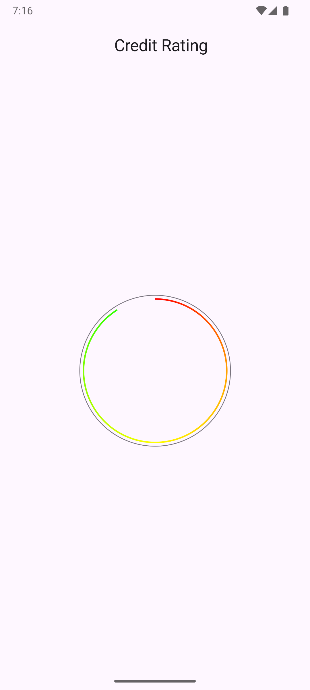

# Credit rating app

## Overview

- This app is build in Kotlin using Compose, ViewModels.
- Material 3 theming is used to allow basic nightmode support, although the progress circle colours are the same for both modes for now

## Assumptions/Simplifications

- Based on the designs I've assumed that the score number text colour should match that of the end point of the progress circle
- No offline support is required, the local cache is a simple in memory data store rather than persistent storage.
- No refresh mechanism has been added for simplicity. No refresh tokens, cache data TTL is handled etc.

### Product data simplifications

- Only the data required to meet the UI requirements is parsed/used
- The min score is assumed to be `0`, `minScoreValue` is ignored for now.

## Accessibility considerations

- The summary composable reads the all text composables at once by using `Modifier.semantics(mergeDescendants = true)`

## Testing

- Unit tests are included for the ViewModel and repository classes
- Espresso tests verify credit summary screen in isolation
- TestFixtures is used to share code between unit and Espresso tests
 
## 3rd Party libraries

- Hilt - To reduce the amount of boilerplate code for dependency injection
- Ktor - For networking as it is Kotlin first (coroutines/KMP etc)
- Kotlin serialization - JSON parsing
- Turbine - to simplify the testing of Flow values returned by ViewModel classes etc

## TODOs/Missing features

- Only rough styling and animations applied, doesn't exactly match the designs.
- E2E and screenshot tests aren't implemented
- No certificate pinning or other security mechanism has been added to the network layer
- No custom launcher icon
- Only default the locale is supported by each string resource
- Only basic error handling is supported, a Snackbar message is shown if the data fails to load.
- The credit score progress composable is used for the loading spinner but the animation may not be the most efficient as it triggers recompositions not just redraws

## Screenshots

### Loading screenshot

Shown while waiting for scores to loaded from the network

### Credit score screenshot

The score is shown once the data is loaded from the network

### Error loading screenshot

If the data fails to load from the network a snackbar message is shown
